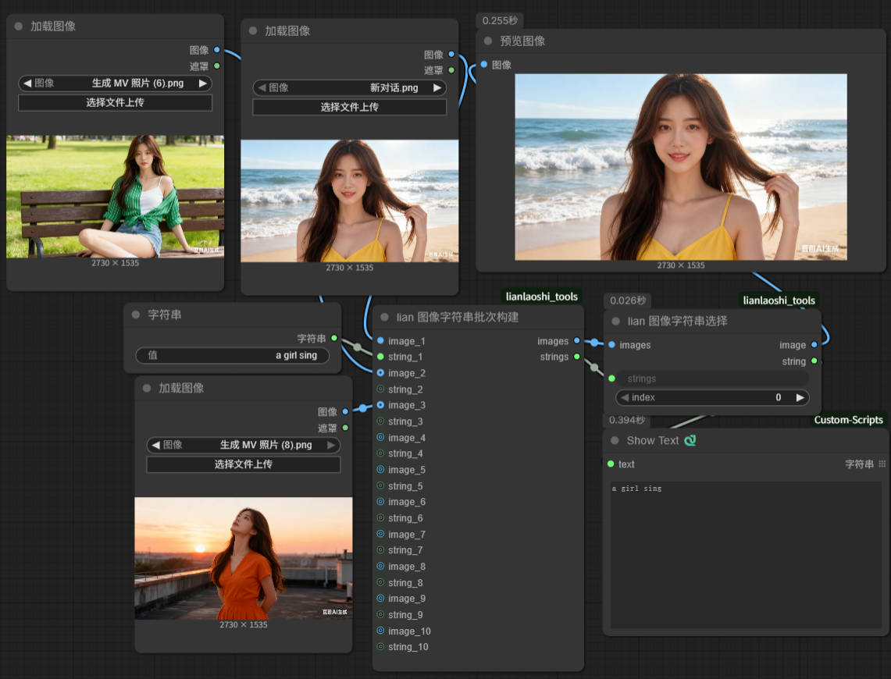
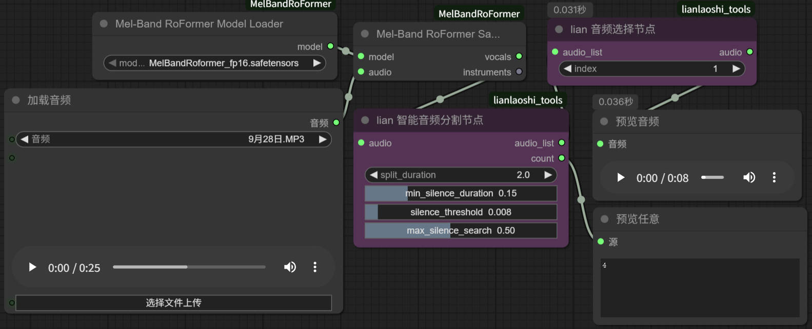
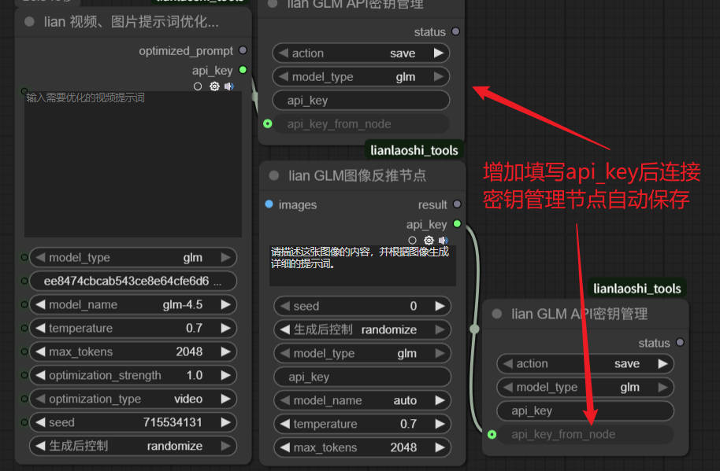
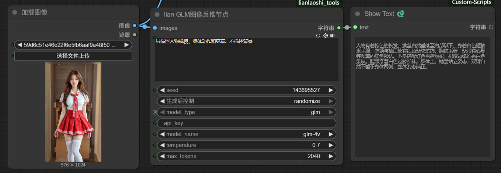
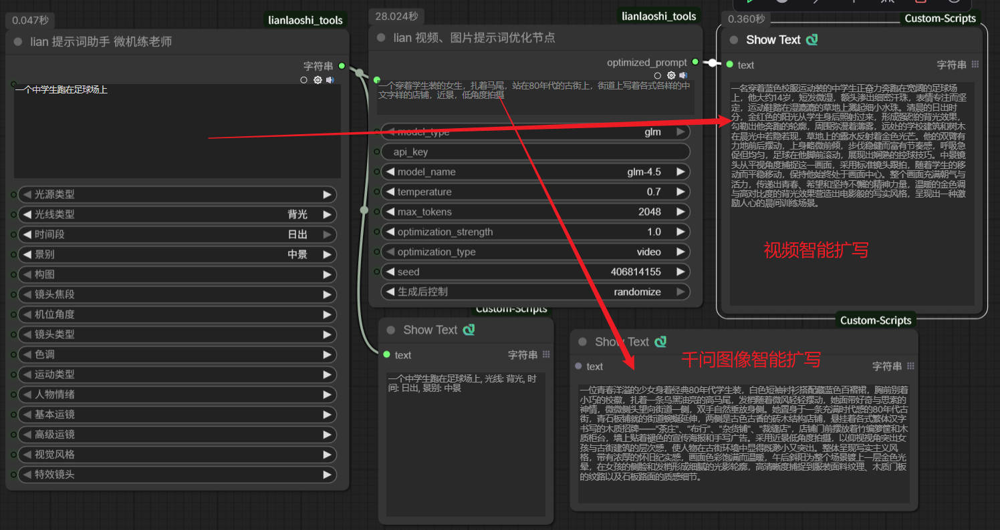
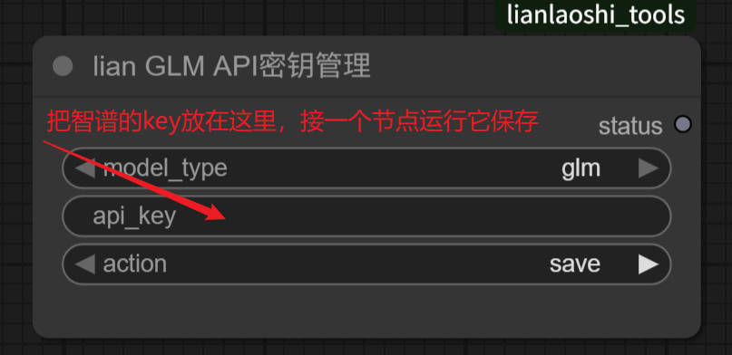
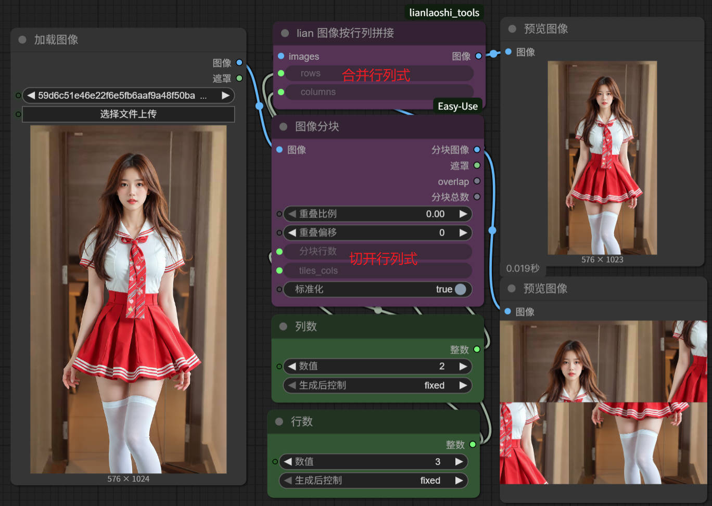
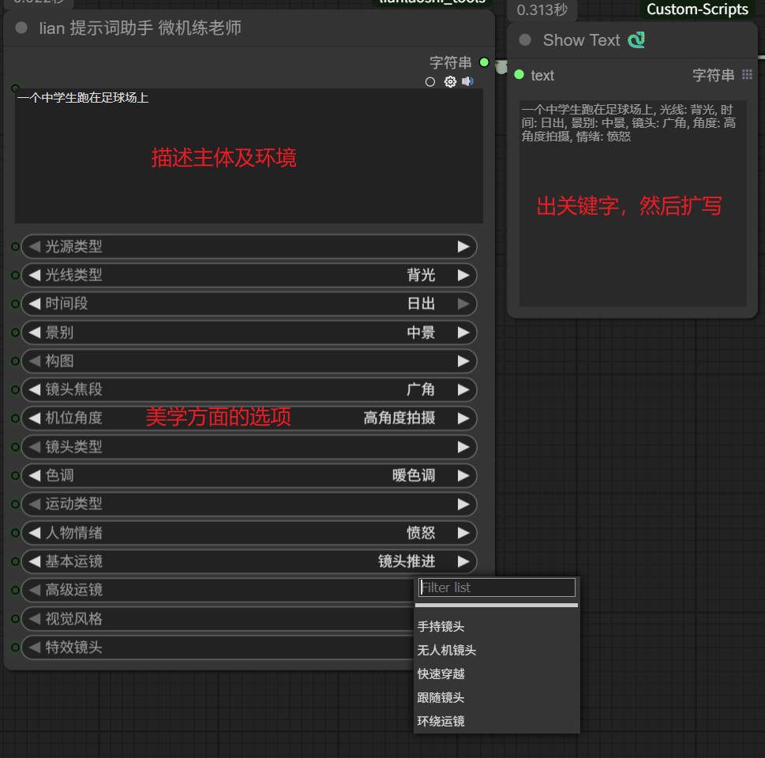

# 练老师工具集 

**练老师工具集**是一个功能丰富的 ComfyUI 自定义节点集合，是自己在使用过程中有所需，就自己写出来的节点插件。

## 📝 更新日志
- 最新版本：
  - 2025-10-26：更新 ImageStringBatch 图片和字符串成对成批次—— 预声明可选输入，自动识别已连接图文对。
    
  - 2025-10-26：更新 AudioSplitNode 音频分割—— 输出为 `AUDIO_LIST` + `count`，与 AudioSelectNode 搭配选择单段音频。
    
- 历史更新：
  - 2025年9月22日 增加了一个通过视频的宽和高及最低分辨率，自动计算出根据分辨率得出的实际所需视频的应剪裁的宽和高数据
  - 修改了 API_key 填写之后，作为输出项连接到密钥保存节点进行保存
  
  
  
  - 支持图片提示词优化：VideoPromptOptimizerNode 新增图片优化模式，支持千问生图格式
  - 增加随机种子参数：支持控制生成内容的可重复性
  - 优化节点结构：简化用户界面，提升操作体验
  - 文档更新：完善使用说明和参数解释
  
  - 更早更新：
    - 视频提示词优化升级：支持通义万相专用格式
    - 功能分离：图像反推与提示词优化功能独立为不同节点
    - 模型优化：专注 GLM 模型支持，简化代码结构
    - 纯提示词输出：优化结果只包含提示词内容，无额外解释

## 🚀 核心功能
- 图像内容反推：使用 GLM 视觉大模型分析图像内容，生成详细描述，可以描述不生成的提示词。
  
  

- 视频/图片提示词优化：根据专业格式自动扩写和优化提示词（有选 wan 视频和千问图片选项）
  
  

- API 密钥管理：便捷地保存和管理 GLM 模型 API 密钥
  
  

- 图像拼接：将多个图像按指定网格排列拼接成大图
  
  

- 提示词构建：通过结构化参数快速生成专业提示词
  
  

## 📋 系统要求
- ComfyUI 最新版本
- Python 3.10+
- 网络连接（用于 API 调用）
- GLM API 密钥（需从智谱 AI 获取）

## 💾 安装方法

### 基础安装
1. 将此工具集文件夹放入 ComfyUI 的 `custom_nodes` 目录下
2. 安装基础依赖：
   ```bash
   python -m pip install -r custom_nodes/lianlaoshi_tools/requirements.txt
   ```
3. 重启 ComfyUI 或使用 Manager → Reload custom nodes

### 分层安装选项

#### 🎯 基础功能 (必需)
```bash
pip install torch>=2.0.0 numpy>=1.24.0 pillow>=10.0.0 requests>=2.31.0
```

#### 🎵 音频处理功能
```bash
pip install scipy>=1.7.0 scikit-learn>=1.0.0 torchaudio>=0.9.0 librosa>=0.9.0 soundfile>=0.10.0
```

#### 🎤 人声分离 (可选)
```bash
# 快速分离
pip install speechbrain>=0.5.0
```

#### 🔧 完整安装 (推荐)
```bash
pip install -r custom_nodes/lianlaoshi_tools/requirements.txt
```

### 人声分离模型管理
如需使用人声分离功能，可使用内置的模型管理器：
```bash
cd custom_nodes/lianlaoshi_tools/models
python model_manager.py check      # 检查模型状态
python model_manager.py download   # 下载所有模型
```

## 🎯 节点详解

### 1. GLM 图像反推节点 (ImageToLLMReverseNode)
- 功能：读取图像并使用 GLM 视觉大模型分析图像内容，生成详细的文本描述。
- 参数说明：
  - images: 输入图像
  - reverse_prompt: 反推要求，指导模型如何分析图像
  - model_type: 模型类型（当前仅支持 "glm"）
  - api_key: GLM 模型 API 密钥（留空则使用已保存的密钥）
  - model_name: 模型选择，可选：auto（自动选择）、glm-4v、glm-4.5v
  - temperature: 温度参数（0.1-1.0），控制输出随机性
  - max_tokens: 最大生成 tokens 数（影响输出长度）
  - seed: 随机种子（0 表示随机，>0 时可复现结果）
- 输出说明：
  - result: 模型生成的图像分析结果文本
  - api_key: 用户在节点中输入的 API 密钥值（如果有输入），可连接到 LLMAPIKeyManager 节点进行保存
- 使用场景：分析图像内容、生成图像描述、辅助提示词创作、将输入的 API 密钥传递给密钥管理节点保存

### 2. 视频/图片提示词优化节点 (VideoPromptOptimizerNode)
- 功能：根据专业提示词结构，自动优化和扩写视频或图片相关的提示词。
- 参数说明：
  - input_prompt: 基础提示词，描述视频或图片内容
  - api_key: GLM 模型 API 密钥（留空则使用已保存的密钥）
  - model_name: 模型选择，可选：auto、glm-4v、glm-4.5v、glm-4.5、glm-4.5-flash
  - temperature: 温度参数（0.1-1.0）
  - max_tokens: 最大生成 tokens 数
  - optimization_strength: 优化强度（0.5-2.0），控制扩写程度
  - optimization_type: 优化类型，可选：video（视频）、image（图片）
- 输出说明：
  - optimized_prompt: 优化后的提示词文本
  - api_key: 用户在节点中输入的 API 密钥值（如果有输入），可连接到 LLMAPIKeyManager 节点进行保存
- 优化结构：
  - 视频优化：按照「主体描述 + 场景描述 + 运动描述 + 镜头语言 + 氛围词 + 风格化」六要素结构优化
  - 图片优化：按照「主体描述 + 细节刻画 + 场景与环境 + 构图与视角 + 艺术风格 + 画质与效果」六要素结构优化
- 使用场景：提升提示词质量、标准化创作流程、快速生成专业级提示词

### 3. LLM API 密钥管理节点 (LLMAPIKeyManager)
- 功能：方便地保存和清除 GLM API 密钥配置，支持从其他节点读取 API 密钥值进行保存。
- 参数说明：
  - action: 操作类型，可选：save（保存）、clear（清除）
  - model_type: 模型类型（可选，默认：glm）
  - api_key: GLM API 密钥（直接输入）
  - api_key_from_node: 从其他节点传入的 API 密钥（隐藏端口，用于连接其他节点）
- 使用说明：
  - 可直接输入 API 密钥并选择 "save" 操作进行保存
  - 可连接 ImageToLLMReverseNode 或 VideoPromptOptimizerNode 的 api_key 输出到 api_key_from_node 端口，自动获取密钥值
  - 选择 "clear" 操作可清除已保存的 API 密钥

### 4. 图像拼接节点 (ImageTilingNode)
- 功能：将多个图像按指定的行列数拼接成一个大图。
- 参数说明：
  - images: 输入图像批次
  - rows: 拼接行数（1-100）
  - columns: 拼接列数（1-100）
- 特性：如输入图像数量不足，将自动用黑色图像填充空缺位置

### 5. 提示词助手节点 (PromptExpansionNode)
- 功能：根据主体描述和各种美学、动态、风格化选项，自动构建完整提示词。
- 参数说明：
  - 主体描述: 详细描述主体特征和环境
  - 美学控制选项（可选）: 光源类型、光线类型、时间段、景别、构图、镜头焦段、机位角度、色调等
  - 动态控制选项（可选）: 运动类型、人物情绪、基本运镜、高级运镜等
  - 风格化表现选项（可选）: 视觉风格、特效镜头等
- 使用场景：快速生成结构化提示词、探索不同风格组合、辅助创作过程

### 6. 音频分割节点 (AudioSplitNode)
- 功能：按静音点或固定时长智能分割音频，输出音频段列表与数量。
- 参数说明：
  - audio: 输入音频
  - split_duration: 分割时长（秒，浮点）
- 输出说明：
  - audio_list: `AUDIO_LIST`
  - count: `INT`
- 使用场景：将长音频按片段拆分，用于后续特定片段处理或导出。

### 7. 音频选择节点 (AudioSelectNode)
- 功能：从 `AUDIO_LIST` 中选取指定索引（0 基）的单段音频。
- 参数说明：
  - audio_list: 输入音频列表（`AUDIO_LIST`）
  - index: 选择索引（`INT`，0 基）
- 输出说明：
  - audio: 单段 `AUDIO`
- 使用场景：与 `AudioSplitNode` 搭配选择需要的片段进入下游处理节点。

### 8. 图文批处理节点 (ImageStringBatch)
- 功能：预声明最多 10 对 `(image_N, string_N)` 可选输入，自动识别已连接的对数并构建批次。
- 特性：
  - 移除了旧的 `inputcount` 参数；无需刷新按钮。
  - 未连接的图片会按首图尺寸自动填充为黑图，未提供的字符串默认为空字符串。
- 输出说明：
  - images: 图像批次
  - strings: 字符串批次

### 9. 图文选择节点 (SelectImageString)
- 功能：从图文批次中按 `index`（0 基）选择一张图与对应字符串。
- 参数说明：
  - images: 图像批次
  - strings: 字符串批次
  - index: 选择索引（`INT`）
- 输出说明：
  - image: 单张 `IMAGE`
  - string: 单个 `STRING`

## ⚙️ 配置指南
### API 密钥配置
- 配置目录：`ComfyUI/custom_nodes/lianlaoshi_tools/config/`
- 密钥文件：`config/api_keys.json`
- 环境变量：可设置系统环境变量，优先级高于配置文件

### 注意事项
- 配置文件包含敏感信息，请妥善保管
- 建议使用密钥管理节点进行密钥配置，避免直接编辑配置文件
- 如切换设备或重新安装，请记得备份配置文件

## 💡 使用示例
### 基础图像反推工作流
1. 添加 `Load Image` 节点加载图像
2. 添加 `lian GLM 图像反推节点`
3. 连接图像输入，配置反推要求和 API 密钥
4. 添加 `Preview Text` 节点查看反推结果
5. 运行工作流

### 视频提示词优化工作流
1. 添加 `Text` 节点输入基础提示词
2. 添加 `lian 视频提示词优化节点`，选择 `optimization_type` 为 `video`
3. 配置优化强度和其他参数
4. 将优化后的提示词连接到视频生成节点
5. 运行工作流

### 音频分割与选择工作流
1. 连接 `AudioSplitNode.audio`，设置 `split_duration`（如 5.0 秒）
2. 将 `AudioSplitNode.audio_list` 接到 `AudioSelectNode.audio_list`
3. 在 `AudioSelectNode.index` 选择片段，得到单段 `audio` 输出用于下游处理

### 图文批次与选择工作流
1. 在 `ImageStringBatch` 连接 `image_1/string_1` 起的各对输入，最多到 `image_10/string_10`
2. 节点自动构建 `(images, strings)` 批次；无需按钮刷新
3. 连接到 `SelectImageString`，用 `index` 选取具体项，得到单张图与对应字符串

### 图像拼贴工作流
1. 将一个 `IMAGE` 批次输入到 `ImageTilingNode.images`
2. 设置 `rows` 与 `columns`
3. 输出为拼贴结果

## ❗ 重要提示
1. 使用前需获取 GLM 模型的 API 密钥（从智谱 AI 官方获取）
2. 确保网络连接稳定，API 调用需要联网
3. 图像分辨率和大小会影响处理时间和 API 调用成本
4. 免费版模型可能有调用次数和速率限制
5. 如遇到 API 调用失败，请检查密钥是否正确、网络是否畅通

---

**练老师工具集** © 2025 | 专注于提升 AI 创作体验的 ComfyUI 扩展